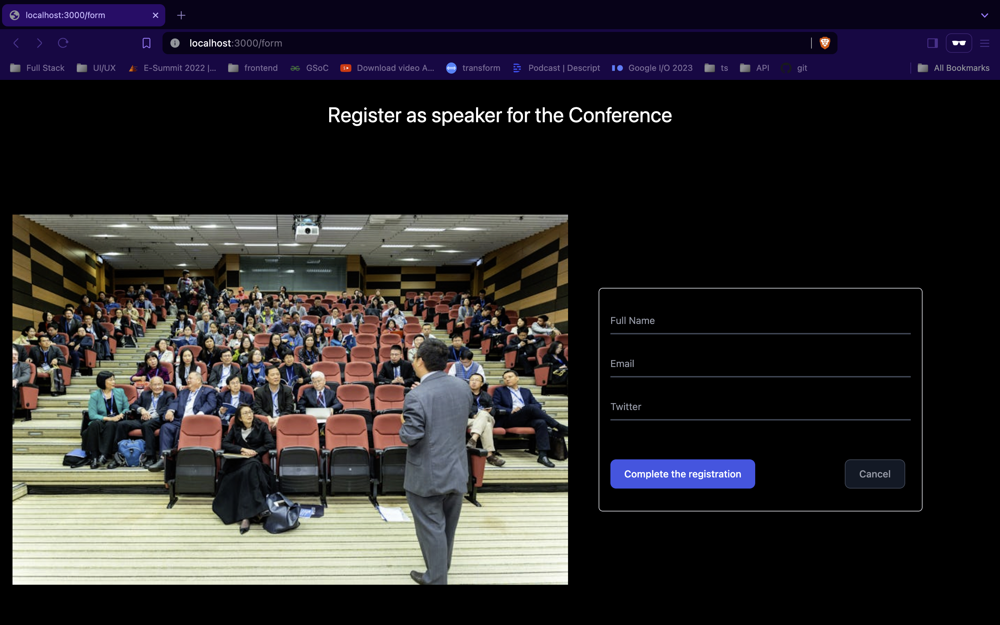
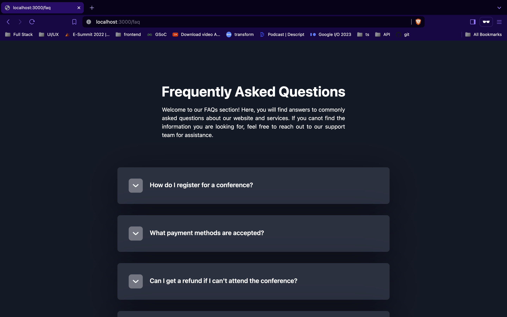

# demo-conference-website

This is a demo work for the GSOC'24 [project](https://github.com/asyncapi/community/blob/master/mentorship/summerofcode/2024/asyncapi-gsoc-ideas-page.md#7-conference-website-maintainance) - conference website maintainance

## Google form responses

Record of the registeration can be checked here. All the submissions of the speaker registration [form](https://forms.gle/DaMvPeFCjLzZE4Jd9) are being saved in a Google Spreadsheet.

Google Spreadsheet dataset - [Speakers Dataset](https://docs.google.com/spreadsheets/d/1RT45LwIyGbEpuFllBgdtsnVfEAfOWXutYtx4PVJypkw/edit?usp=sharing)

## FAQs

Add FAQ page to the conference website as part of the demo work for the project

